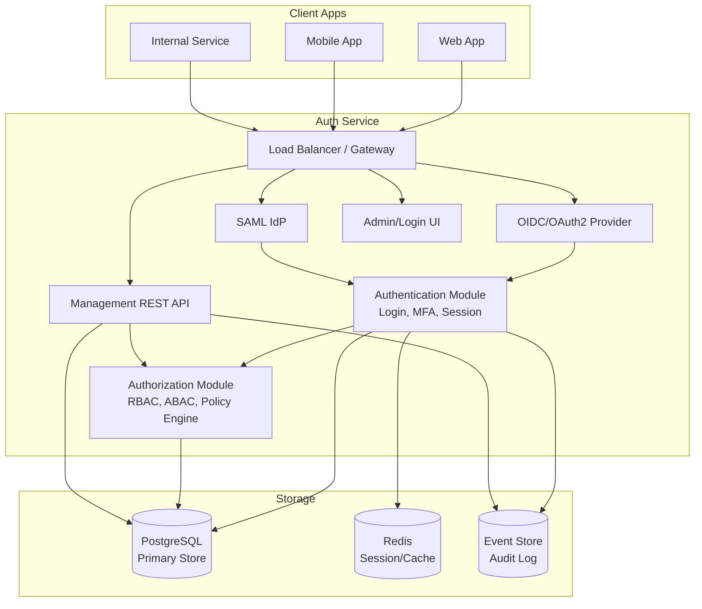

# 03 — Architecture

## Big Picture

The Auth Service consists of several logical components. In the MVP, all of these can run as **a single binary/service** (modular monolith) to enable fast build & deploy; it can later be split into microservices if separate scaling is actually needed.

## Core Components

### 1. Authentication Module
Responsible for proving "who you are": password login, MFA (TOTP, WebAuthn/passkey, SMS/email OTP — phased), passwordless (magic link, WebAuthn), social login federation, and session management (login once → SSO across all apps).

### 2. OIDC/OAuth2 Provider
Implements standard endpoints (`/authorize`, `/token`, `/userinfo`, `/jwks`, `/.well-known/openid-configuration`), supports Authorization Code + PKCE (mandatory for all clients), Client Credentials, and Refresh Token grants. Full contract in `05-API-CONTRACT.md`.

### 3. SAML Identity Provider (later phase)
For integrating with enterprise/legacy applications that only support SAML 2.0. Supports IdP-initiated & SP-initiated flows.

### 4. Authorization Module
Role-Based Access Control (RBAC) with custom roles per project, cross-organization delegation (Project Grants), and an optional Attribute-Based Access Control (ABAC) policy engine. Full detail in `08-AUTHORIZATION.md`.

### 5. Management REST API
CRUD for instance, organization, project, application, user, role, and grant — used by the console but also directly usable for automation (Terraform provider, CI/CD provisioning, etc.). Full contract in `05-API-CONTRACT.md`.

### 6. Admin/Login UI
A centralized login page (hosted login page) plus a management console. See `UI-UX/` for design planning and `06-FRONTEND-ARCHITECTURE.md` for technical architecture.

## Main Data Flow (SSO)

1. A user opens **Application A** → not logged in → gets redirected to the Auth Service's `/authorize`.
2. Auth Service checks: is there an active session in the browser (cookie)?
   - **No session yet** → show login page → user logs in (+ MFA if enabled) → a session is created.
   - **Session already exists** → proceed immediately (this is what makes SSO feel "seamless").
3. Auth Service redirects back to Application A with an *authorization code*.
4. Application A (its backend) exchanges the code for tokens at the `/token` endpoint (server-to-server, using PKCE).
5. Application A receives an ID Token + Access Token → the user is considered logged in.
6. The user opens **Application B** → gets redirected to `/authorize` again → since a session already exists at the Auth Service, the user **doesn't need to log in again** → immediately gets a code → then a token.

## Separation of Concerns

| Layer | Responsible for | Not responsible for |
|---|---|---|
| Auth Service | Who the user is, their role/permissions, issuing tokens | Business logic of other applications |
| Consumer application | Validating tokens, enforcing authorization within its own business context | Storing user passwords |

Continue to [04 — Data Model](./04-DATA-MODEL.md).
