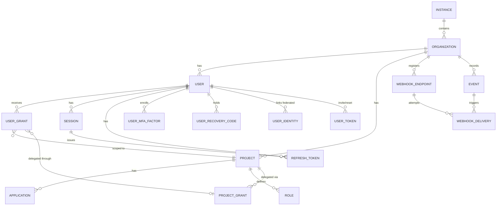

# 04 — Data Model

## Entity Hierarchy (Zitadel-style)

```
Instance (platform/deployment level)
 └── Organization (tenant / company / team)
      ├── Project (a group of applications sharing roles, e.g. "Internal Tools")
      │    ├── Application (a specific OIDC/SAML client, e.g. "Web Dashboard", "Mobile App")
      │    ├── Role (defined per project, e.g. "admin", "viewer")
      │    └── Project Grant (delegation of this project to another organization — see 08-AUTHORIZATION.md)
      ├── User (a member of the organization)
      │    ├── MFA Factor (TOTP secret / WebAuthn credential — a user may hold several)
      │    ├── Identity (a linked federated login: Google, Microsoft, GitHub)
      │    ├── Session (browser SSO session)
      │    └── Refresh Token (grouped into rotation families)
      ├── User Grant (mapping: User × Project × Role[])
      └── Webhook Endpoint (outbound event delivery)
```

Alongside the hierarchy sit entities scoped to the deployment rather than to any one organization — `signing_keys` (instance-wide, since every organization's tokens are signed by the same key set) and `events` (org-scoped rows, but one append-only table).

## Core Entities

### `users`
| Column | Type | Notes |
|---|---|---|
| id | uuid (PK) | |
| org_id | uuid (FK) | |
| email | text (unique per org) | |
| username | text (optional, unique per org) | |
| password_hash | text (nullable) | nullable because login can also happen via social/passwordless only |
| status | enum | active, locked, invited, deactivated |
| mfa_enabled | bool | denormalized fast flag for the login path; `user_mfa_factors` below is the source of truth |
| created_at / updated_at | timestamp | |

### `organizations`
| Column | Type |
|---|---|
| id | uuid (PK) |
| instance_id | uuid (FK) |
| name | text |
| domain | text (for domain verification / email-based routing) |
| settings | jsonb (password policy, mandatory MFA, etc.) |

### `projects`
| Column | Type |
|---|---|
| id | uuid (PK) |
| org_id | uuid (FK) |
| name | text |

### `applications` (OIDC/SAML client)
| Column | Type | Notes |
|---|---|---|
| id | uuid (PK) | serves as the `client_id` |
| project_id | uuid (FK) | |
| type | enum | `web`, `native`, `spa`, `api`, `saml` |
| client_secret_hash | text (nullable) | null for public clients (SPA/native) which must use PKCE |
| redirect_uris | text[] | |
| grant_types | text[] | |
| post_logout_redirect_uris | text[] | |

### `roles`
| Column | Type | Notes |
|---|---|---|
| id | uuid (PK) | |
| project_id | uuid (FK) | |
| key | text (e.g. `admin`, `editor`) | unique per project — "admin" in Project A is unrelated to "admin" in Project B (`08-AUTHORIZATION.md` Part A) |
| display_name | text | |
| permission_keys | text[] | the permission keys this role carries, e.g. `{"user:read","billing:write"}` (`08-AUTHORIZATION.md` Part A) |
| is_builtin | bool | built-in roles (`org_owner`, `org_admin`) cannot be renamed or deleted |

> An array column rather than a `role_permissions` join table, matching the pattern already used by `user_grants.role_keys` and `project_grants.granted_role_keys`. Permission keys are free-form strings scoped to the consumer application's own vocabulary, not rows this service needs to join against or enforce referential integrity on.

### `user_grants`
| Column | Type | Notes |
|---|---|---|
| id | uuid (PK) | |
| user_id | uuid (FK) | |
| project_id | uuid (FK) | |
| project_grant_id | uuid (FK, nullable) | set if this grant came through a Project Grant delegation |
| role_keys | text[] | |

### `project_grants` (cross-organization delegation — see `08-AUTHORIZATION.md`)
| Column | Type | Notes |
|---|---|---|
| id | uuid (PK) | |
| project_id | uuid (FK) | |
| granting_org_id | uuid (FK) | |
| granted_org_id | uuid (FK) | |
| granted_role_keys | text[] | |
| status | enum | `active`, `revoked` |

### `manager_roles` (tiered administrative roles, distinct from application roles)
| Column | Type | Notes |
|---|---|---|
| id | uuid (PK) | |
| user_id | uuid (FK) | |
| role | enum | `INSTANCE_OWNER`, `ORG_OWNER`, `ORG_ADMIN`, `PROJECT_OWNER`, `PROJECT_GRANT_OWNER` |
| scope_id | uuid | id of the instance/org/project/project_grant relevant to that role |

### `user_attributes` (for ABAC — see `08-AUTHORIZATION.md`)
| Column | Type | Notes |
|---|---|---|
| user_id | uuid (FK) | |
| org_id | uuid (FK) | |
| attributes | jsonb | e.g. `{"department": "finance", "clearance_level": 3}` |

### `policies` (for ABAC — see `08-AUTHORIZATION.md`)
| Column | Type | Notes |
|---|---|---|
| id | uuid (PK) | |
| org_id | uuid (FK) | |
| project_id | uuid (FK, nullable) | |
| name | text | |
| rego_source | text | |
| status | enum | `draft`, `active`, `disabled` |
| version | int | |

### `sessions`
| Column | Type | Notes |
|---|---|---|
| id | uuid (PK) | stored as a cookie ID in the browser |
| user_id | uuid (FK) | |
| org_id | uuid (FK) | denormalized for row-level security scoping (`08-AUTHORIZATION.md` Part B) |
| created_at | timestamp | |
| last_seen_at | timestamp | drives idle timeout and the "last active" column on the sessions screen |
| expires_at | timestamp | absolute lifetime, from `organizations.settings.session_lifetime_hours` |
| revoked_at | timestamp (nullable) | revocation is a status transition, not a delete — the record is needed for audit |
| auth_methods | text[] | e.g. `["password", "totp"]` — used for step-up auth |
| ip / user_agent | text | for the "active sessions" page & anomaly detection |

> **Where sessions actually live.** PostgreSQL is the durable record — it backs the "active sessions" screen, admin session management, and audit. Redis holds a short-TTL lookup copy so the silent-SSO path on `/oauth/authorize` meets its latency target (`12-PERFORMANCE.md`) without a database round-trip per request. The two are not independent stores: **PostgreSQL is authoritative**, Redis is a cache. A revocation writes `revoked_at` in PostgreSQL and invalidates the Redis entry in the same operation, so revocation is immediate rather than TTL-bound (`17-ACCEPTANCE-CRITERIA.md` Phase 3). If the Redis entry is missing, fall through to PostgreSQL; never treat a cache miss as "no session."

### `refresh_tokens`
| Column | Type | Notes |
|---|---|---|
| id | uuid (PK) | |
| user_id | uuid (FK) | |
| client_id | uuid (FK) | |
| session_id | uuid (FK, nullable) | revoking a session revokes the tokens issued through it |
| family_id | uuid | rotation lineage — all tokens descended from one original issuance share it |
| replaced_by | uuid (FK, nullable) | set when this token is rotated; presenting a token that has a `replaced_by` is **reuse** |
| token_hash | text | never store the raw token |
| expires_at | timestamp | per-token lifetime |
| family_expires_at | timestamp | absolute lifetime of the whole family, so continuous refreshing can't extend a session forever |
| revoked | bool | |

> `family_id` and `replaced_by` exist from the start even though rotation with reuse detection is Phase 3 (`16-IMPLEMENTATION-ROADMAP.md`), so that phase changes behavior rather than the storage shape. On detecting reuse, the entire family is revoked (`09-SECURITY.md`).

### `signing_keys`
| Column | Type | Notes |
|---|---|---|
| id | uuid (PK) | |
| kid | text (unique) | the `kid` published in JWKS and carried in the JWT header |
| purpose | enum | `oidc`, `saml` — SAML assertion signing uses a distinct key set from OIDC tokens |
| algorithm | text | `RS256` / `ES256` — never `HS256` (`07-BACKEND-ARCHITECTURE.md`) |
| public_key | text | published via `/.well-known/jwks.json` |
| private_key_ref | text | a **reference** into the secret manager, never the key material itself (`02-REQUIREMENTS.md` § Constraints) |
| status | enum | `next` (published, not yet signing), `current` (signing), `previous` (still verifying), `retired` |
| created_at / activated_at / retired_at | timestamp | |

> Key **state** lives in the database rather than in the binary or its configuration, because `14-DEPLOYMENT.md`'s rollback strategy requires that rolling the application back never invalidates tokens signed under a newer key. Only the private key material lives in the secret manager; this table holds the reference to it. Multiple keys are active simultaneously to give rotation the overlap window `09-SECURITY.md` requires.

### `user_mfa_factors`
| Column | Type | Notes |
|---|---|---|
| id | uuid (PK) | |
| user_id | uuid (FK) | |
| type | enum | `totp`, `webauthn` |
| secret_encrypted | bytea (nullable) | TOTP shared secret, encrypted at rest (`09-SECURITY.md` § Transport & Storage) |
| credential_id / public_key | text (nullable) | WebAuthn credential; there is no server-side secret to protect for this type |
| sign_count | bigint (nullable) | WebAuthn signature counter, for cloned-authenticator detection |
| status | enum | `pending` (enrolled, not yet verified), `active` |
| label | text | user-supplied name, e.g. "work laptop" — needed to disambiguate multiple factors |
| created_at / last_used_at | timestamp | |

> `users.mfa_enabled` remains as a fast denormalized flag for the login path, but this table is the source of truth. A user may hold several factors of either type — losing one device must not mean losing the account (`17-ACCEPTANCE-CRITERIA.md` Phase 3).

### `user_recovery_codes`
| Column | Type | Notes |
|---|---|---|
| id | uuid (PK) | |
| user_id | uuid (FK) | |
| code_hash | text | hashed with the same rigor as a password — these are credentials |
| used_at | timestamp (nullable) | single-use; regenerating invalidates every outstanding code |

### `user_tokens`
| Column | Type | Notes |
|---|---|---|
| id | uuid (PK) | |
| user_id | uuid (FK) | |
| purpose | enum | `invite`, `password_reset`, `email_verification` |
| token_hash | text | the raw token exists only in the email that carried it |
| expires_at | timestamp | short-lived |
| used_at | timestamp (nullable) | single-use |
| created_at | timestamp | |

> One table with a purpose discriminator rather than three near-identical tables. All three flows share the same security properties — single-use, short-lived, stored hashed — and the same abuse surface (`SECURITY/02-ATTACK-SURFACE-AND-SCENARIOS.md` §10, §12).

### `user_identities` (federated login links)
| Column | Type | Notes |
|---|---|---|
| id | uuid (PK) | |
| user_id | uuid (FK) | |
| provider | text | `google`, `microsoft`, `github` |
| provider_subject | text | the provider's **stable subject identifier** — unique with `provider` |
| linked_at | timestamp | |

> Matching is on `provider_subject`, never on email: email is mutable at most providers, and trusting it is the account-takeover path. A federated user still gets a normal `users` row so roles and grants work identically regardless of login method (`05-API-CONTRACT.md` § Social login).

### `webhook_endpoints`
| Column | Type | Notes |
|---|---|---|
| id | uuid (PK) | |
| org_id | uuid (FK) | |
| url | text | validated against the SSRF policy on every write (`SECURITY/02-ATTACK-SURFACE-AND-SCENARIOS.md` §7) |
| event_types | text[] | subscribed events, from the taxonomy in `events` |
| secret_hash | text | per-endpoint signing secret; receivers verify payload authenticity with it |
| status | enum | `active`, `disabled` — auto-disabled after sustained delivery failure |
| created_at | timestamp | |

### `webhook_deliveries`
| Column | Type | Notes |
|---|---|---|
| id | bigserial (PK) | |
| endpoint_id | uuid (FK) | |
| event_id | bigint (FK → `events.id`) | |
| attempt | int | |
| response_status | int (nullable) | |
| delivered_at / next_retry_at | timestamp | |

> Retained short-term for integration debugging, not as an audit record — `events` is the audit record. Subject to the same retention discipline as `events` below.

### `events` (append-only audit log)
| Column | Type | Notes |
|---|---|---|
| id | bigserial (PK) | |
| org_id | uuid | every query is org-scoped; no filter combination may cross tenants |
| actor_user_id | uuid (nullable) | null for a failed login against an account that doesn't exist, and for system-initiated events |
| event_type | text | e.g. `user.login.success`, `role.assigned` |
| payload | jsonb | redacted before storage — an audit log that records a password attempt is a credential store |
| created_at | timestamp | |

**Append-only is enforced at the database layer**, not by convention: the application role has no `UPDATE` or `DELETE` privilege on this table (`SECURITY/02-ATTACK-SURFACE-AND-SCENARIOS.md` §19).

#### Retention and Growth

This table grows without bound and is on the read path of the console's Audit Log screen, so it needs a stated policy rather than an emergent one:

- **Partitioning**: monthly range partitions on `created_at`. Queries are overwhelmingly recent-first and time-bounded (`UI-UX/08-PAGE-SPECIFICATIONS.md`), so partition pruning keeps them fast as the table grows, and dropping an expired partition is cheap where deleting rows would not be.
- **Retention**: **24 months hot**, then archived to cold storage rather than deleted. The number is a starting default — confirm it against whatever compliance obligation actually applies before production (`09-SECURITY.md` § Compliance), since an audit log that is shorter than the applicable retention requirement is a compliance failure and one that is longer is an unnecessary liability.
- **Erasure requests**: GDPR's right to erasure and an immutable audit log are in genuine tension. The resolution is **pseudonymization, not deletion** — on an erasure request, the personal data in `users` is erased and the `actor_user_id` reference is retained as an opaque identifier that no longer resolves to a person. The event chain stays intact and the security record survives, while the personal data does not. Deleting audit rows to satisfy an erasure request would destroy exactly the evidence an incident investigation depends on (`SECURITY/04-INCIDENT-RESPONSE-PLAYBOOKS.md`).
- `webhook_deliveries` follows the same partitioning approach with a much shorter retention, since it is a debugging aid rather than an audit record.

### What Is Deliberately Not Stored Here

| Artifact | Where it lives | Why |
|---|---|---|
| Access tokens, ID tokens (JWT) | Nowhere — stateless | Signature verification is sufficient; storing them would add a lookup to the hottest path in the system for no security gain |
| Authorization codes | **Redis, with a TTL under 60 seconds** | Single-use and very short-lived, so durability across a restart is not required, and an automatic expiry is stronger than a cleanup job that can fail silently. Redemption must be **atomic** — two concurrent redemptions of one code must yield exactly one success (`05-API-CONTRACT.md` Part A) |
| PKCE `code_challenge` | Redis, alongside the authorization code it belongs to | Same lifetime, same single use |
| Private signing keys | Secret manager; only a reference is in `signing_keys` | `02-REQUIREMENTS.md` § Constraints: no third party holds the private key |
| Session lookup cache | Redis, backed by the authoritative `sessions` table | See the note under `sessions` above |

Refresh tokens and sessions **are** stored, because both must be revocable and queryable.

## Relationship Diagram (simplified)



Continue to [05 — API Contract](./05-API-CONTRACT.md).
