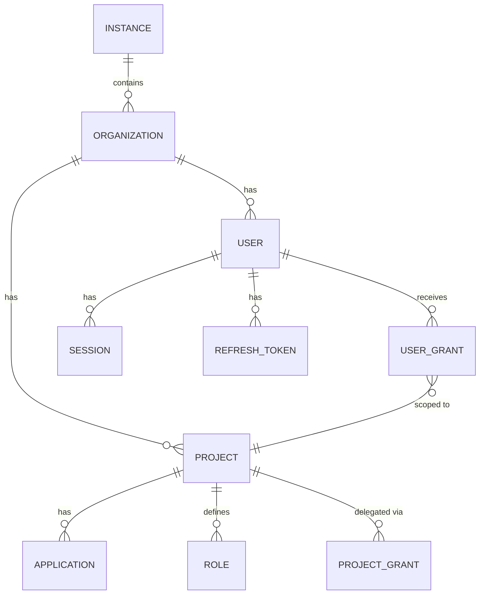

# 04 — Data Model

## Entity Hierarchy (Zitadel-style)

```
Instance (platform/deployment level)
 └── Organization (tenant / company / team)
      ├── Project (a group of applications sharing roles, e.g. "Internal Tools")
      │    ├── Application (a specific OIDC/SAML client, e.g. "Web Dashboard", "Mobile App")
      │    ├── Role (defined per project, e.g. "admin", "viewer")
      │    └── Project Grant (delegation of this project to another organization — see 08-AUTHORIZATION.md)
      ├── User (a member of the organization)
      └── User Grant (mapping: User × Project × Role[])
```

## Core Entities

### `users`
| Column | Type | Notes |
|---|---|---|
| id | uuid (PK) | |
| org_id | uuid (FK) | |
| email | text (unique per org) | |
| username | text (optional, unique per org) | |
| password_hash | text (nullable) | nullable because login can also happen via social/passwordless only |
| status | enum | active, locked, invited, deactivated |
| mfa_enabled | bool | |
| created_at / updated_at | timestamp | |

### `organizations`
| Column | Type |
|---|---|
| id | uuid (PK) |
| instance_id | uuid (FK) |
| name | text |
| domain | text (for domain verification / email-based routing) |
| settings | jsonb (password policy, mandatory MFA, etc.) |

### `projects`
| Column | Type |
|---|---|
| id | uuid (PK) |
| org_id | uuid (FK) |
| name | text |

### `applications` (OIDC/SAML client)
| Column | Type | Notes |
|---|---|---|
| id | uuid (PK) | serves as the `client_id` |
| project_id | uuid (FK) | |
| type | enum | `web`, `native`, `spa`, `api`, `saml` |
| client_secret_hash | text (nullable) | null for public clients (SPA/native) which must use PKCE |
| redirect_uris | text[] | |
| grant_types | text[] | |
| post_logout_redirect_uris | text[] | |

### `roles`
| Column | Type |
|---|---|
| id | uuid (PK) |
| project_id | uuid (FK) |
| key | text (e.g. `admin`, `editor`) |
| display_name | text |

### `user_grants`
| Column | Type | Notes |
|---|---|---|
| id | uuid (PK) | |
| user_id | uuid (FK) | |
| project_id | uuid (FK) | |
| project_grant_id | uuid (FK, nullable) | set if this grant came through a Project Grant delegation |
| role_keys | text[] | |

### `project_grants` (cross-organization delegation — see `08-AUTHORIZATION.md`)
| Column | Type | Notes |
|---|---|---|
| id | uuid (PK) | |
| project_id | uuid (FK) | |
| granting_org_id | uuid (FK) | |
| granted_org_id | uuid (FK) | |
| granted_role_keys | text[] | |
| status | enum | `active`, `revoked` |

### `manager_roles` (tiered administrative roles, distinct from application roles)
| Column | Type | Notes |
|---|---|---|
| id | uuid (PK) | |
| user_id | uuid (FK) | |
| role | enum | `INSTANCE_OWNER`, `ORG_OWNER`, `ORG_ADMIN`, `PROJECT_OWNER`, `PROJECT_GRANT_OWNER` |
| scope_id | uuid | id of the instance/org/project/project_grant relevant to that role |

### `user_attributes` (for ABAC — see `08-AUTHORIZATION.md`)
| Column | Type | Notes |
|---|---|---|
| user_id | uuid (FK) | |
| org_id | uuid (FK) | |
| attributes | jsonb | e.g. `{"department": "finance", "clearance_level": 3}` |

### `policies` (for ABAC — see `08-AUTHORIZATION.md`)
| Column | Type | Notes |
|---|---|---|
| id | uuid (PK) | |
| org_id | uuid (FK) | |
| project_id | uuid (FK, nullable) | |
| name | text | |
| rego_source | text | |
| status | enum | `draft`, `active`, `disabled` |
| version | int | |

### `sessions`
| Column | Type | Notes |
|---|---|---|
| id | uuid (PK) | stored as a cookie ID in the browser |
| user_id | uuid (FK) | |
| created_at | timestamp | |
| expires_at | timestamp | |
| auth_methods | text[] | e.g. `["password", "totp"]` — used for step-up auth |
| ip / user_agent | text | for the "active sessions" page & anomaly detection |

### `refresh_tokens`
| Column | Type |
|---|---|
| id | uuid (PK) |
| user_id | uuid (FK) |
| client_id | uuid (FK) |
| token_hash | text (never store the raw token!) |
| expires_at | timestamp |
| revoked | bool |

### `events` (append-only audit log)
| Column | Type |
|---|---|
| id | bigserial (PK) |
| org_id | uuid |
| actor_user_id | uuid (nullable) |
| event_type | text (e.g. `user.login.success`, `role.assigned`) |
| payload | jsonb |
| created_at | timestamp |

> Note: Access Tokens & ID Tokens (JWT) are **not stored** in the DB (stateless — signature verification is enough). Only refresh tokens and sessions are stored, since they need to be revocable/queryable.

## Relationship Diagram (simplified)



Continue to [05 — API Contract](./05-API-CONTRACT.md).
