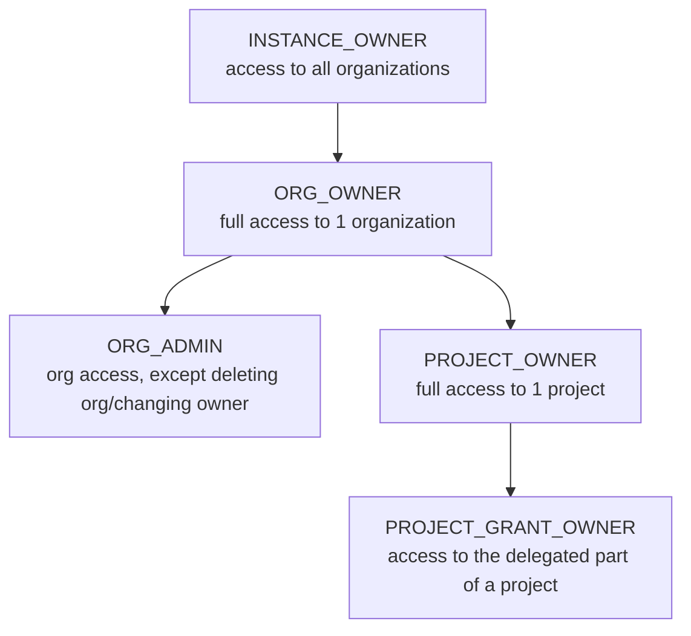

# 08 — Authorization (RBAC, Multi-Tenant Delegation, ABAC)

This document covers the full authorization model: base RBAC, multi-tenant scoping, cross-organization delegation (Project Grants), tiered administrative roles (Manager Roles), and the optional ABAC layer. These are presented together because they form one layered system, not separate features.

## Part A — Base RBAC

### Model

**RBAC (Role-Based Access Control)** is the foundation — simple, easy to understand, sufficient for most cases. ABAC (Part D below) is added later for authorization scenarios RBAC can't express cleanly.

### Role Structure

- Roles are defined **per Project** (`04-DATA-MODEL.md`), not globally — so "admin" in Project A doesn't automatically become "admin" in Project B.
- Each role has a list of **permission keys** (a free-form string like `resource:action`, e.g. `user:read`, `billing:write`).
- Roles can be **built-in** (`org_owner`, `org_admin`) or **custom** (created by an organization admin).

### How Role Claims Get Into the Token

```json
{
  "sub": "user-uuid",
  "org_id": "org-uuid",
  "urn:authservice:iam:org:project:proj_pos:roles": {
    "cashier": { "org_id": "org_acme" },
    "manager": { "org_id": "org_acme" }
  },
  "amr": ["password", "totp"]
}
```

The consumer application (resource server) validates the token (signature + expiry) and reads the role claims to make authorization decisions **on its own side**. For real-time or resource-level decisions, use `/v1/authz/check` (`05-API-CONTRACT.md`).

## Part B — Multi-Tenancy Scoping

### Data Isolation Strategy

| Level | Strategy | Reason |
|---|---|---|
| MVP | Shared database, shared schema, isolated via `org_id` on every table + PostgreSQL row-level security (RLS) | Simplest, sufficient for early scale |
| Growth | Indexing & partitioning per `org_id` for large tenants | Keeps performance stable as data grows |
| Enterprise (optional, far future) | Database per tenant | Only for clients with strict, contractual isolation requirements |

> Don't jump straight to "database per tenant" — start with shared schema + `org_id` and RLS so a misscoped query can't leak data across organizations.

### Tenant Resolution

Options (combinable): by domain (`acme.auth.company.com`), by path, by email domain at login, or a single default organization for purely internal deployments. MVP: single default organization, schema kept multi-tenant-ready.

### Policies per Organization

```json
{
  "password_policy": { "min_length": 12, "require_uppercase": true, "max_age_days": 90 },
  "mfa_required": true,
  "session_lifetime_hours": 12,
  "allowed_login_methods": ["password", "webauthn", "google"]
}
```

## Part C — Cross-Organization Delegation (Project Grants) & Manager Roles

### Why More Than Plain RBAC

The case: **you (a vendor) have one application, sell it to many clients (each client = an organization), and each client wants to control who on their own team is admin/user** — without you creating accounts one by one. Two mechanisms enable this:

1. **Roles belong to a Project**, so a single role definition can be shared with other organizations.
2. **Project Grant** — the owning organization "lends" a project to another organization; the borrowing organization self-manages which of its own users get which (allowed) role.

### Entities (see `04-DATA-MODEL.md` for full schema)

- `project_grants`: which project is delegated, to which org, with which subset of roles (`granted_role_keys`), and its status.
- `user_grants.project_grant_id`: distinguishes a direct grant (owning org's own user) from a grant obtained through delegation.
- `manager_roles`: administrative roles (`INSTANCE_OWNER`, `ORG_OWNER`, `ORG_ADMIN`, `PROJECT_OWNER`, `PROJECT_GRANT_OWNER`) — these govern who can **administer the Auth Service itself**, distinct from application-level roles that govern access **within consumer applications**.

### Manager Role Hierarchy & Inheritance



Rules: permissions flow **downward** only (Instance Owner has all Org Owner rights across every org, but not vice versa); `PROJECT_GRANT_OWNER` only applies to roles actually delegated via `project_grants`.

### Token Claim Format (Extended for Delegation)

```json
{
  "urn:authservice:iam:org:project:proj_pos:roles": {
    "cashier": { "org_id": "org_acme" }
  },
  "urn:authservice:manager_roles": ["ORG_ADMIN"]
}
```

Including `org_id` inside the role's value (not just as the key) avoids ambiguity when a role of the same name could apply from two different organizational contexts.

### Full Permission Check Flow

```
1. Verify token signature & expiry.
2. Read the role claim for the relevant project.
3. If accessed within a client organization's context (multi-tenant SaaS):
   a. Ensure org_id in the role claim matches the current request's tenant context.
   b. If the role came via a project_grant, verify it's still active (short-TTL cache, not a DB hit per request).
4. Match the role against the permission required by the endpoint.
5. Allow/deny.
```

For sensitive actions, prefer the real-time `/v1/authz/check` endpoint over trusting token claims alone, since a `project_grant` may have been revoked after the token was issued.

### API for Managing Delegation

```
POST   /v1/organizations/{granting_org_id}/projects/{project_id}/grants
       { "granted_org_id": "org_client_b", "role_keys": ["cashier", "manager"] }

GET    /v1/organizations/{granting_org_id}/projects/{project_id}/grants
DELETE /v1/organizations/{granting_org_id}/projects/{project_id}/grants/{grant_id}

# From the receiving organization's side:
POST   /v1/organizations/{granted_org_id}/project-grants/{grant_id}/user-grants
       { "user_id": "usr_in_org_b", "role_keys": ["cashier"] }
```

The last endpoint **must validate** that requested `role_keys` are a subset of `granted_role_keys` — otherwise the receiving organization could grant itself roles it shouldn't have.

### Concrete Scenario

An internal "Procurement Portal" needs to let an external vendor submit quotes: create a `vendor_submitter` role, create a Project Grant limited to that one role, let the vendor's own admin (`PROJECT_GRANT_OWNER`) assign it to their own staff, and revoke the whole grant in one action if the partnership ends.

## Part D — ABAC (Attribute-Based Access Control)

### Why ABAC on Top of RBAC

RBAC alone strains when authorization depends on facts that can't reasonably be baked into a role, e.g. "an approver can only approve requests from their own department, up to their personal limit." Modeling every combination as a separate role explodes combinatorially. ABAC evaluates a **policy** against **attributes** at decision time instead.

### Core Concepts

| Concept | Meaning | Example |
|---|---|---|
| Subject | The requesting user + attributes | `user.department = "finance"`, `user.roles = ["approver"]` |
| Resource | The thing acted on + attributes | `resource.type = "purchase_request"`, `resource.amount = 8000000` |
| Action | What is being attempted | `approve`, `read`, `delete` |
| Environment | Facts about the request | `time`, `ip`, `network` |
| Policy | A rule combining the above into a decision | "Allow `approve` if `subject.department == resource.department` and `resource.amount <= subject.approval_limit`" |

RBAC roles become just one more attribute available to policies (`subject.roles`) — the two layers combine rather than compete.

### Policy Engine: OPA / Rego

Recommended: **Open Policy Agent**, embedded as a Go library in-process (avoids a network hop on every check), with policies written in **Rego** — declarative, decoupled from application code, testable in CI.

### Data Model Additions

`user_attributes` (custom subject attributes per org) and `policies` (Rego source, versioned, `draft`/`active`/`disabled`) — full schema in `04-DATA-MODEL.md`.

### Extended `/v1/authz/check` Contract

See `05-API-CONTRACT.md` for the full request/response example, including a `matched_policy` and `reasons` field — returning *why* a decision was made matters for both support and audit.

### Example Policy (Rego, illustrative)

```rego
package authz.purchase_approval

default allow = false

allow {
    input.action == "approve"
    input.resource.type == "purchase_request"
    "approver" in input.subject.roles
    input.subject.attributes.department == input.resource.attributes.department
    input.resource.attributes.amount <= input.subject.attributes.approval_limit
}
```

### Safe Rollout

New/edited policies start as `draft` and can be run in **dry-run mode** against real recent requests before activation, catching unintended lockouts before production. Every activation creates a new `version`; rollback to a previous version is a single action. Changes to `active` policies go through the same review discipline as code changes (`09-SECURITY.md`).

### Roadmap Placement

ABAC is **optional** — most organizations may never need it if RBAC + Project Grants already cover their needs. It's placed at Phase 4b in `16-IMPLEMENTATION-ROADMAP.md`: don't build it speculatively, only once a concrete need appears that RBAC genuinely can't express.

## Least Privilege Principle (Applies Throughout)

The default role for a new user is **no access** (must be granted explicitly). Every permission-sensitive action (inviting a new admin, deleting an organization, creating/revoking a Project Grant, activating a policy) requires a mandatory audit log entry, and ideally an additional confirmation step (re-auth / MFA step-up).

Continue to [09 — Security](./09-SECURITY.md).
