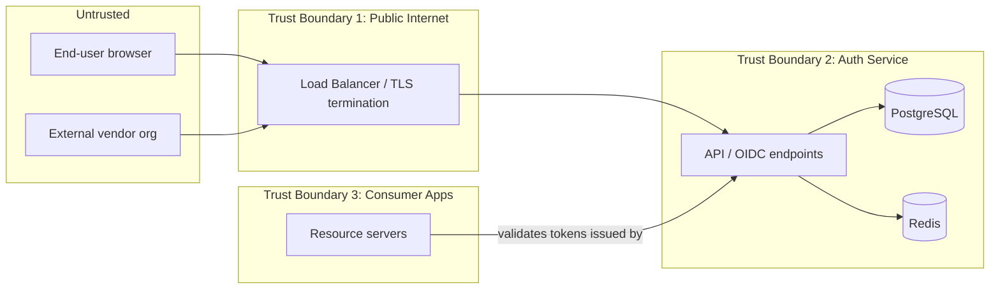

# 10 — Threat Model

> **Note**: this document is a STRIDE-level summary. The full, per-scenario breakdown (Asset → Trust Boundary → Threat Actor → Attack Surface → Scenario → Impact → Likelihood → Mitigation → Detection → Response, covering all 19 specific attack categories from authentication attacks through logging/audit integrity) lives in the dedicated **`SECURITY/`** folder — start at `SECURITY/00-ASSET-AND-TRUST-BOUNDARY-INVENTORY.md`.

This document applies a structured threat-modeling pass (STRIDE) to the Auth Service, complementing the control list in `09-SECURITY.md`. Re-run this exercise before any major new phase (SAML, ABAC, Project Grants) is implemented, not just once at the start.

## Trust Boundaries

Key boundaries: (1) public internet → load balancer, (2) load balancer → Auth Service internals, (3) Auth Service → consumer applications trusting its tokens, (4) owning organization → delegated (granted) organization via Project Grants — this last one is a trust boundary too, and often overlooked.

## STRIDE Analysis

### Spoofing
| Threat | Mitigation | Reference |
|---|---|---|
| Attacker impersonates a legitimate user via stolen credentials | Argon2id hashing, breached-password checks, rate limiting, MFA | `09-SECURITY.md` |
| Attacker impersonates a legitimate client application | Client authentication (secret or PKCE), exact-match `redirect_uri` | `05-API-CONTRACT.md` |
| A malicious/compromised granted organization impersonates the owning organization's users | Project Grant scoping strictly limits which roles can be assumed; `org_id` embedded in role claims | `08-AUTHORIZATION.md` |

### Tampering
| Threat | Mitigation |
|---|---|
| Token payload modified in transit or at rest | JWT signature verification (RS256/ES256), TLS everywhere |
| Audit log entries altered after the fact | Append-only `events` table, forwarded to external SIEM |
| A Rego policy tampered with to widen access | Policy versioning, review requirement before activation, audit log of policy changes |

### Repudiation
| Threat | Mitigation |
|---|---|
| An admin denies performing a sensitive action (deleting a user, revoking a grant) | Every sensitive action logged with actor, timestamp, and payload in `events` |
| A user denies a login/action was theirs | Session records include IP/user-agent for correlation |

### Information Disclosure
| Threat | Mitigation |
|---|---|
| Access token/refresh token leaked via logs | Never log tokens or passwords; structured logging with explicit allow-lists of loggable fields |
| Cross-tenant data leak via a misscoped query | Row-level security keyed on `org_id`, enforced at the DB layer, not just application code |
| Client secret exposed in a public repo | Secrets shown once at creation, never retrievable again; stored as a hash |
| Resource attributes sent to `/v1/authz/check` logged or cached insecurely | Resource attributes treated as sensitive by default; no long-term caching of attribute payloads |

### Denial of Service
| Threat | Mitigation |
|---|---|
| Credential-stuffing flood against `/oauth/token` | Per-account and per-IP rate limiting, CAPTCHA after repeated failures |
| A single misbehaving API client exhausts shared capacity | Rate limits scoped per `client_id`, not just per IP |
| DB/Redis degradation cascades into every consumer app being unable to authenticate | Circuit breakers, graceful degradation, read replicas — `13-OBSERVABILITY.md`, `12-PERFORMANCE.md` |

### Elevation of Privilege
| Threat | Mitigation |
|---|---|
| A user escalates via a role not intended for them | Least-privilege default (no access unless granted), permission checks on every management endpoint |
| A granted organization assigns itself roles beyond what was delegated | Server-side validation that `role_keys` ⊆ `granted_role_keys` on every user-grant creation via a Project Grant |
| An ABAC policy bug grants unintended access | Dry-run mode before activation, mandatory review for `active` policy changes |
| Manager role inheritance misapplied (e.g. `PROJECT_GRANT_OWNER` reaching undelegated roles) | Explicit scope checks in the authorization module, covered by dedicated tests — `11-TESTING.md` |

## High-Priority Abuse Scenarios to Test

These map directly to test cases expected in `11-TESTING.md`:

1. Token with a valid signature but wrong `aud` is rejected by a resource server.
2. A `redirect_uri` that is a prefix (not exact) match is rejected.
3. A used (rotated) refresh token cannot be reused.
4. A receiving organization cannot assign a role outside its `granted_role_keys`.
5. A revoked Project Grant immediately invalidates access, not just at next token issuance.
6. Row-level security actually prevents a cross-org query from returning another org's data, even if application-layer filtering is accidentally omitted.

## Review Cadence

- Re-run this STRIDE pass whenever a new trust boundary is introduced (e.g. adding SAML, adding a new external integration).
- Feed newly identified risks into `18-RISK-REGISTER.md`.
- For the detailed, per-scenario verification plan (what "tested" actually means for each threat category), see `SECURITY/05-VERIFICATION-AND-REDTEAM-PLAN.md`.

Continue to [11 — Testing](./11-TESTING.md).
